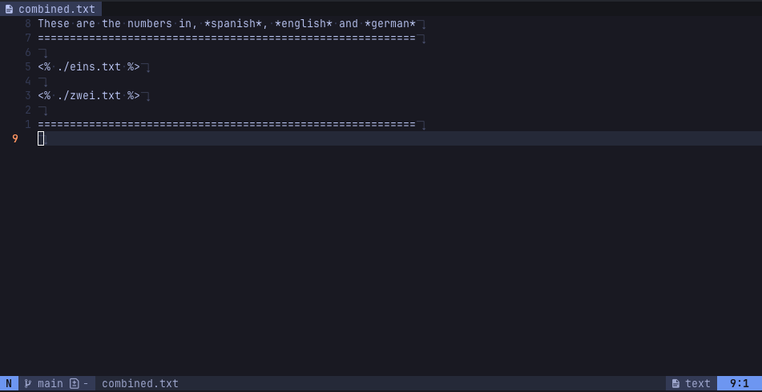
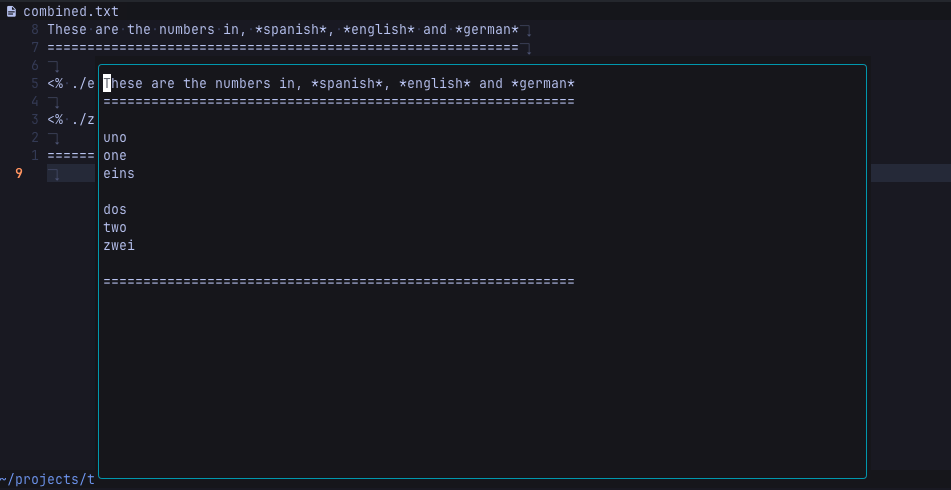

# tempra.nvim

Template Render Path

## Inspiration

Have you wanted to have your IDE configuration separated by multiples
files but can't ?

With this you could have a file structure that look like this:

```
.
└── code/
    ├── settings.json
    ├── general.json
    ├── vim.json
    └── some-plugin.json
```

When all the config is rendered on the floating window you could dump it on
your IDE ;)


## Preview

Have a template like this, where you have another file "imported" like
this `<% ./my-file.txt %>`:



Once you run the command `:TempraToggle` a new window popup will open
with the rendered version of what's imported.



## Install

### Lazy

Currently only tested on lazy.nvim 😅

```lua
{
  'nicanordlc/tempra.nvim',
  opts = {
    max_recursion_depth = 5,
    mappings = {
      close = { "<esc>", "q" },
    },
  },
  cmd = 'TempraToggle',
  keys = {
    {
      '<leader>tp',
      '<cmd>TempraToggle<cr>',
      desc = 'Toggle [t]empra',
    },
  },
}
```

### Todo

- [ ] Highlight the imports
